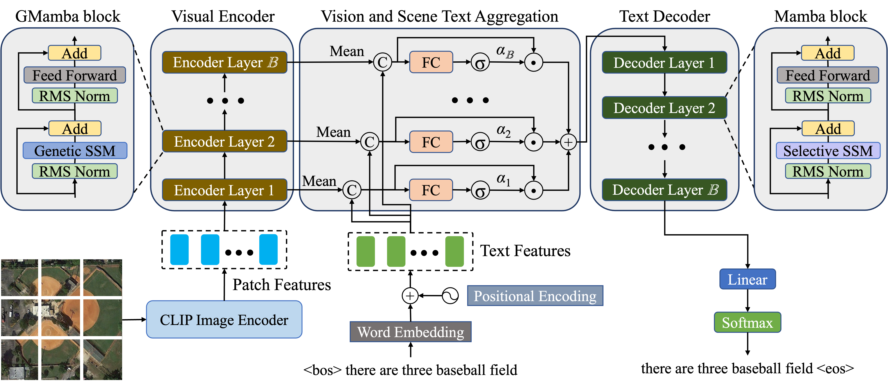

# RSIC-GMamba

<p align="center">
  
</p>

## Installation and Dependencies
Please [Vim](https://github.com/hustvl/Vim)
Create the `gmamba` conda environment using the `environment.yml` file:
```
conda env create -f environment.yml
conda activate gmamba
```

**Issue:** iter(dataloader) typeerror:'generator' object is not callable

**Solution:** 
cd /home/dmd/anaconda3/envs/gmamba/lib/python3.10/site-packages/torch/utils/data/_utils/fetch.py

`Modify the _MapDatasetFetcher function as follows:`
```
class _MapDatasetFetcher(_BaseDataSetFetcher):
    def fetch(self, possibly_batched_index):
        if self.auto_collation:
            data = [self.dataset[idx] for idx in possibly_batched_index]
        else:
            data = self.dataset[possibly_batched_index]
        return self.collate_fn(data)
 ```       
        


## Data preparation
For the evaluation metrics, Please download the [evaluation.zip](https://pan.baidu.com/s/13ZfH-CMYbW3RsW0-RX7KKQ)(BaiduPan code:wuiu) and extract it to `./evaluation`.


For CLIP Feature Extraction:  Please refer to [pre_CLIP_feature](https://github.com/One-paper-luck/MG-Transformer/blob/main/feature_pro/pre_CLIP_feature.py) 


## Train
```
python train.py
```

## Evaluate
```
python test.py
```


# Citation:
```
@ARTICLE{10915627,
  author={Meng, Lingwu and Wang, Jing and Xiao, Liang},
  journal={IEEE Transactions on Geoscience and Remote Sensing}, 
  title={A Multiscale Grouping Transformer with CLIP Latents for Remote Sensing Image Captioning}, 
  year={2025},
  volume={63},
  number={},
  pages={1-16},
  doi={10.1109/TGRS.2025.3548664}}
```


## Reference:
1. https://github.com/tylin/coco-caption
2. https://github.com/aimagelab/meshed-memory-transformer
3. https://github.com/hustvl/Vim
4. https://github.com/alxndrTL/mamba.py
